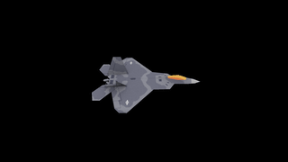

# 3dgraphics
This repository contains my programming exercises and project code related to 3D computer graphics.

## How to install
Install dependencies to compile and run the program

```
sudo apt install build-essential
sudo apt install libsdl2-dev libsdl2-image-dev # 3D Computer Graphics from Scratch
```

## How to run
To compile and run the main program (e.g., `src/main.c`), use the following command:
```
make build
make run
```

## Features (latest-first)
**Based on the course *3D Computer Graphics from Scratch* by Gustavo Pezzi ([@Pikuma](https://www.pikuma.com))**
<div style="text-align: center; display: inline-block;">
  <div><strong>Current Output:</strong> Rendering with Look At Camera Model. </div>
  
</div>

**Topics Covered So Far**
* Code Refactoring
* Clipping
* Camera: Look At Camera Model
* Z-Buffer
* Textured OBJ Files
* Decoding PNG Files
* Perspective Correct Texture Mapping
* Texture Mapping
* Light and Shading, Flat Shading
* Projection Matrix, NDC Coordinates, and their Properties
* 3D Matrix Transformations
* Sorting Faces by Depth and Painter's Algorithm
* Triangle Rasterization: Flat-Top, Flat-Bottom Algorithm
* Vector Operations Recap
* Backface Culling: Keep "Back" Faces Invisible
* Dynamic Arrays and Reading .obj File Content
* DDA Line Drawing Algorithm
* Triangles and Vertices Recap
* Fixed Time Step with Delay Function
* Linear Transformations
* Projection of Points Recap: Orthographic, Isometric, and Perspective
* Vectors and Points using C Structs
* Modular Structure with Multiple Header Files
* Color Buffer Implementation for Pixel-level Drawing
* SDL Setup for Window Creation and Rendering
