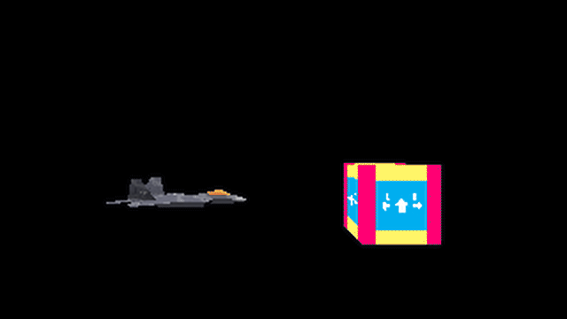

# 3dgraphics
This repository contains my exercise code of the course *3D Computer Graphics from Scratch* by Gustavo Pezzi ([@Pikuma](https://www.pikuma.com)).

## How to install
Install dependencies to compile and run the program
```
sudo apt install build-essential
sudo apt install libsdl2-dev libsdl2-image-dev # for 3D Computer Graphics from Scratch
```

For texture mapping based on `png` files, we use `upng`.
```
curl -fSL "https://raw.githubusercontent.com/elanthis/upng/master/upng.h" -o ./include/upng.h
curl -fSL "https://raw.githubusercontent.com/elanthis/upng/master/upng.c" -o ./src/upng.c
```

## How to run
To compile and run the main program (e.g., `src/main.c`), use the following command:
``` shell
make build
cd build
./renderer
```
note that you may need a mesh file `.obj` and its corresponding texture a `.png` file.<br>

To run mini rasterizer `src-tr/main.c`, use the following command:
``` shell
make build-tr
cd build-tr
./rasterizer
```

## Features
**Final Output: Displaying Multiple Meshes**
<div style="text-align: center; display: inline-block;">
  
</div>

**Mini Rasterizer Output: Subpixel Rasterization**
<div style="text-align: center; display: inline-block;">
  
</div>

**Topics Covered So Far** (latest-first)
* A Better Triangle Rasterizer, Edge Function, Subpixel Rasterization
* Multiple Meshes
* Code Refactoring and Polishing
* Clipping
* Camera: Look At Camera Model
* Z-Buffer
* Textured OBJ Files
* Decoding PNG Files
* Perspective Correct Texture Mapping
* Texture Mapping
* Light and Shading, Flat Shading
* Projection Matrix, NDC Coordinates, and their Properties
* 3D Matrix Transformations
* Sorting Faces by Depth and Painter's Algorithm
* Triangle Rasterization: Flat-Top, Flat-Bottom Algorithm
* Vector Operations Recap
* Backface Culling: Keep "Back" Faces Invisible
* Dynamic Arrays and Reading .obj File Content
* DDA Line Drawing Algorithm
* Triangles and Vertices Recap
* Fixed Time Step with Delay Function
* Linear Transformations
* Projection of Points Recap: Orthographic, Isometric, and Perspective
* Vectors and Points using C Structs
* Modular Structure with Multiple Header Files
* Color Buffer Implementation for Pixel-level Drawing
* SDL Setup for Window Creation and Rendering
